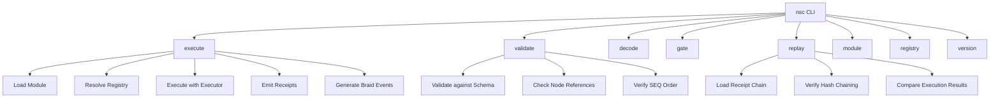
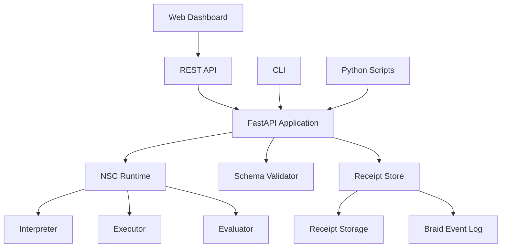
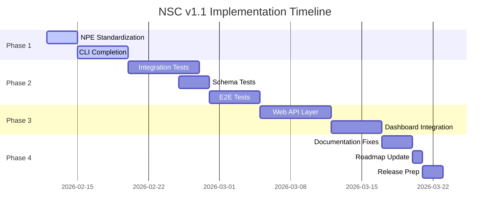

# NSC Tokenless v1.1 Implementation Plan

**Created:** 2026-02-12  
**Status:** Ready for Review  
**Based on:** Repository Assessment (2026-02-12)

---

## Executive Summary

This plan addresses gaps identified in the repository assessment, focusing on:
1. NPE version standardization
2. CLI integration completion
3. Integration test framework
4. Web API layer for dashboard
5. Documentation fixes
6. Roadmap updates

---

## Phase 1: NPE Version Standardization

### 1.1 Analysis of Current State

| File | Lines | Purpose | Recommendation |
|------|-------|---------|----------------|
| `npe_v0_1.py` | ~800 | Legacy implementation | **Archive** - mark deprecated |
| `npe_v1_0.py` | ~1185 | Coherence-aligned, production-ready | **Keep as stable** |
| `npe_v2_0.py` | ~920 | Beam-search synthesis, full metrics | **Promote to default** |

### 1.2 Recommended Strategy (v2.0 as Default)

```
nsc/
├── __init__.py              # Export default: from nsc import NPE_v2_0
├── npe_v0_1.py              # Move to deprecated/ folder
├── npe_v1_0.py              # Keep (stable alternative)
├── npe_v2_0.py              # Rename to npe.py (default)
└── deprecated/
    └── npe_v0_1.py          # Archived with deprecation notice
```

### 1.3 Action Items

- [ ] Create `nsc/__init__.py` exporting v1.0 as default
- [ ] Create `nsc/deprecated/` directory
- [ ] Move `npe_v0_1.py` to deprecated with warning
- [ ] Add version selector to CLI (`--npe-version v1|v2`)
- [ ] Update all imports to use default export
- [ ] Update documentation to clarify version strategy

---

## Phase 2: CLI Integration Completion

### 2.1 Current State Analysis

**Existing commands in `nsc/cli.py`:**
- `execute` - Executes module (partially implemented)
- `validate` - Validates module (stub)
- `decode` - Decodes GLLL signal (implemented)
- `gate` - Evaluates gate policy (implemented)
- `version` - Shows version (implemented)

### 2.2 Missing Functionality

| Command | Status | Gap |
|---------|--------|-----|
| `execute` | Partial | Missing receipt emission, braid events |
| `validate` | Stub | No actual schema validation |
| `replay` | Missing | Core feature per spec |
| `receipt` | Missing | Receipt analysis commands |
| `module` | Missing | Module linking, digest generation |
| `registry` | Missing | Registry management |

### 2.3 CLI Architecture Design



### 2.4 Implementation Plan

**File structure:**
```
nsc/cli.py                    # Main CLI entry point (refactor)
nsc/cli/
├── __init__.py
├── execute.py                # execute command
├── validate.py               # validate command
├── decode.py                 # decode command (move existing)
├── gate.py                   # gate command (move existing)
├── replay.py                 # NEW - replay verification
├── module.py                 # NEW - module management
├── registry.py               # NEW - registry management
└── utils.py                  # Shared utilities
```

### 2.5 Action Items

- [ ] Refactor CLI into `nsc/cli/` package
- [ ] Implement full `execute` with receipts and braid events
- [ ] Complete `validate` with schema validation
- [ ] Add `replay` command for verification
- [ ] Add `module` command (linking, digest)
- [ ] Add `registry` command
- [ ] Add `--output-format` flag (json, pretty, braid)
- [ ] Add `--strict` flag for strict validation
- [ ] Update pyproject.toml console scripts

---

## Phase 3: Integration Test Framework

### 3.1 Current Test Coverage

```
tests/
├── conftest.py           # 134 lines - fixtures
├── test_glyphs.py        # GLLL decode tests
├── test_governance.py    # Gate checker tests
├── test_npe.py           # NPE tests
├── test_runtime.py       # 216 lines - best coverage
└── test_smoke.py         # 154 lines - import tests
```

### 3.2 Missing Test Categories

| Category | Files | Priority |
|----------|-------|----------|
| Integration Tests | 0 | **High** |
| End-to-End Tests | 0 | **High** |
| Schema Validation Tests | 0 | **Medium** |
| CLI Command Tests | 0 | **Medium** |
| Braid Event Tests | 0 | **Medium** |
| Replay Verification Tests | 0 | **Low** |

### 3.3 Recommended Test Structure

```
tests/
├── conftest.py                    # Base fixtures
├── fixtures/
│   ├── modules/                   # Sample modules
│   │   ├── minimal.json
│   │   ├── psi_governed.json
│   │   └── psi_minimal.json
│   ├── registries/                # Sample registries
│   │   └── default.json
│   ├── receipts/                  # Sample receipts
│   │   └── chain.json
│   └── braid_events/              # Sample braid events
│       └── events.json
│
├── test_smoke.py                  # Existing - keep
├── test_runtime.py                # Existing - expand
├── test_glyphs.py                 # Existing - keep
├── test_governance.py             # Existing - keep
├── test_npe.py                    # Existing - keep
│
├── test_integration/              # NEW
│   ├── __init__.py
│   ├── test_module_execution.py   # Full execution flow
│   ├── test_module_validation.py  # Schema + reference checks
│   ├── test_receipt_chain.py      # Hash chaining
│   ├── test_braid_events.py       # Event emission
│   └── test_module_linking.py     # Multi-module linking
│
├── test_cli/                      # NEW
│   ├── __init__.py
│   ├── test_execute_command.py
│   ├── test_validate_command.py
│   ├── test_decode_command.py
│   ├── test_gate_command.py
│   └── test_replay_command.py
│
├── test_schemas/                  # NEW
│   ├── __init__.py
│   ├── test_module_schema.py
│   ├── test_node_schema.py
│   ├── test_receipt_schema.py
│   └── test_braid_schema.py
│
└── test_e2e/                      # NEW
    ├── __init__.py
    ├── test_full_workflow.py      # Module → Execute → Receipts
    └── test_replay_workflow.py    # Execute → Replay → Verify
```

### 3.4 Integration Test Examples

**Example: Module Execution Test**

```python
"""test_integration/test_module_execution.py"""
import pytest
from pathlib import Path
import json

from nsc.runtime.interpreter import Interpreter
from nsc.runtime.environment import Environment


class TestModuleExecution:
    """Integration tests for module execution."""
    
    @pytest.fixture
    def sample_module_path(self):
        return Path(__file__).parent.parent / "fixtures" / "modules" / "minimal.json"
    
    @pytest.fixture
    def default_registry(self):
        return {
            "registry_id": "default",
            "operators": [
                {"op_id": 1001, "name": "ADD", ...},
                {"op_id": 1002, "name": "SUB", ...},
            ]
        }
    
    def test_execute_simple_module(self, sample_module_path, default_registry):
        """Test executing a minimal module produces correct results."""
        # Load module
        with open(sample_module_path) as f:
            module = json.load(f)
        
        # Setup environment
        env = Environment(registry=default_registry)
        env.kernels = {...}  # Setup kernels
        
        # Execute
        interpreter = Interpreter(env=env)
        result = interpreter.interpret(module)
        
        # Verify
        assert result.success is True
        assert len(result.receipts) == module["nodes"].count("APPLY")
        assert result.braid_events is not None
    
    def test_execution_produces_valid_receipts(self, sample_module_path, default_registry):
        """Test that execution produces receipts matching schema."""
        # Execute module
        interpreter = Interpreter(env=Environment(registry=default_registry))
        result = interpreter.interpret(json.load(open(sample_module_path)))
        
        # Verify receipts
        for receipt in result.receipts:
            assert "event_id" in receipt
            assert "digest" in receipt
            assert "node_id" in receipt
            assert "op_id" in receipt
        
        # Verify hash chaining
        for i in range(1, len(result.receipts)):
            prev = result.receipts[i-1]
            curr = result.receipts[i]
            expected = hashlib.sha256(
                json.dumps(prev, sort_keys=True).encode()
            ).hexdigest()
            assert curr["digest_in"] == expected
```

### 3.5 Action Items

- [ ] Create `tests/test_integration/` package
- [ ] Create `tests/test_cli/` package
- [ ] Create `tests/test_schemas/` package
- [ ] Create `tests/test_e2e/` package
- [ ] Add fixtures for modules, registries, receipts, braid events
- [ ] Write 5+ integration tests for module execution
- [ ] Write 5+ tests for CLI commands (using click.testing.CliRunner)
- [ ] Write schema validation tests
- [ ] Configure pytest coverage reporting
- [ ] Add CI workflow for running tests

---

## Phase 4: Web API Layer

### 4.1 Current State

| Component | Status | Notes |
|-----------|--------|-------|
| `nsc_dashboard.html` | Exists | 850 lines, standalone HTML |
| `src/App.tsx` | Exists | React components, UI shells |
| Backend API | **Missing** | No connection to Python runtime |

### 4.2 Architecture Design



### 4.3 API Design

**Endpoints:**

| Method | Endpoint | Description |
|--------|----------|-------------|
| POST | `/api/v1/execute` | Execute a module |
| POST | `/api/v1/validate` | Validate a module |
| GET | `/api/v1/receipts/{id}` | Get receipt by ID |
| GET | `/api/v1/modules/{id}` | Get module by ID |
| POST | `/api/v1/replay` | Verify receipt chain |
| GET | `/api/v1/registries` | List registries |
| GET | `/api/v1/health` | Health check |

**Example Request:**
```json
POST /api/v1/execute
{
  "module": {...},  // NSC module JSON
  "registry": {...}, // Optional operator registry
  "options": {
    "emit_receipts": true,
    "emit_braid": true,
    "timeout": 30
  }
}
```

**Example Response:**
```json
{
  "success": true,
  "result": {...},
  "receipts": [...],
  "braid_events": [...],
  "execution_time_ms": 45.2
}
```

### 4.4 Implementation Plan

**File structure:**
```
api/
├── __init__.py
├── main.py                    # FastAPI application
├── routes/
│   ├── __init__.py
│   ├── execute.py             # /execute endpoint
│   ├── validate.py            # /validate endpoint
│   ├── receipts.py            # /receipts endpoints
│   ├── modules.py             # /modules endpoints
│   └── replay.py              # /replay endpoint
├── models/
│   ├── __init__.py
│   ├── request.py             # Request models
│   └── response.py            # Response models
└── dependencies.py            # FastAPI dependencies
```

**Example implementation:**

```python
# api/main.py
from fastapi import FastAPI
from api.routes import execute, validate, receipts, modules, replay

app = FastAPI(
    title="NSC Tokenless API",
    version="1.1.0",
    description="API for NSC Tokenless execution engine"
)

app.include_router(execute.router, prefix="/api/v1")
app.include_router(validate.router, prefix="/api/v1")
app.include_router(receipts.router, prefix="/api/v1")
app.include_router(modules.router, prefix="/api/v1")
app.include_router(replay.router, prefix="/api/v1")


@app.get("/api/v1/health")
async def health_check():
    return {"status": "healthy", "version": "1.1.0"}
```

### 4.5 Dashboard Integration

Update `nsc_dashboard.html` to fetch from API:

```javascript
// Replace hardcoded data with API calls
async function executeModule(moduleJson) {
    const response = await fetch('/api/v1/execute', {
        method: 'POST',
        headers: {'Content-Type': 'application/json'},
        body: JSON.stringify({module: moduleJson})
    });
    return response.json();
}
```

### 4.6 Action Items

- [ ] Create `api/` directory with FastAPI structure
- [ ] Implement `/api/v1/execute` endpoint
- [ ] Implement `/api/v1/validate` endpoint
- [ ] Implement `/api/v1/receipts/*` endpoints
- [ ] Implement `/api/v1/replay` endpoint
- [ ] Add OpenAPI documentation at `/docs`
- [ ] Update `nsc_dashboard.html` to use API
- [ ] Add CORS configuration for local development
- [ ] Create `run_api.py` script for starting server
- [ ] Update pyproject.toml with api dependencies

---

## Phase 5: Documentation Fixes

### 5.1 Identified Issues

| Issue | Location | Severity |
|-------|----------|----------|
| Broken links | SPEC.md → some docs | Medium |
| Outdated references | paper/ → spec | Low |
| Missing index | docs/ needs index.md | Medium |
| Version confusion | NPE versions | High |

### 5.2 Fix Plan

**5.2.1 Create docs/index.md**
```markdown
# NSC Tokenless Documentation

## Getting Started
- [Overview](docs/overview.md)
- [Core Model](docs/nsc_core_model.md)
- [Execution Determinism](docs/nsc_execution_determinism.md)

## Language Reference
- [Module Linking](docs/language/nsc_module_linking.md)
- [Error Model](docs/language/nsc_error_model.md)

## Wire Format
- [Canonicalization](docs/wire/canonicalization.md)
- [JSON Profile](docs/wire/json_profile.md)
...

## Governance
- [Replay Verification](docs/governance/replay_verification.md)

## API Reference
- [CLI Commands](docs/cli_reference.md)
- [Python API](docs/python_api.md)
```

**5.2.2 Fix SPEC.md Links**
- Audit all links in SPEC.md
- Create missing referenced documents
- Add link verification test

**5.2.3 Add Version Documentation**
- Create `docs/versions.md` explaining NPE strategy
- Add deprecation notices to v0.1 code
- Add migration guide for v0.1 → v1.0

### 5.3 Action Items

- [ ] Create `docs/index.md` with full navigation
- [ ] Audit and fix broken links in SPEC.md
- [ ] Create `docs/versions.md` with NPE version strategy
- [ ] Add deprecation warnings to npe_v0_1.py
- [ ] Create migration guide for v0.1 → v1.0
- [ ] Add link checker to CI pipeline

---

## Phase 6: Roadmap Updates

### 6.1 Current Roadmap Status

Based on `plans/nsc_roadmap_v1_1.md`:

| Phase | Status | Notes |
|-------|--------|-------|
| Phase 0: Spec Review | Partial | Docs done, cross-ref incomplete |
| Phase 1: Runtime | Partial | Core done, CLI incomplete |
| Phase 2: Testing | Partial | Unit tests done, integration missing |
| Phase 3: Web Interface | Partial | UI exists, API missing |
| Phase 4: Publication | Not Started | Not ready |

### 6.2 Updated Roadmap



### 6.3 Action Items

- [ ] Update `plans/nsc_roadmap_v1_1.md` with actual status
- [ ] Add completion percentages
- [ ] Create milestone tracker in GitHub issues
- [ ] Add release checklist

---

## Summary of Action Items

### High Priority
1. [ ] Standardize NPE versions (Phase 1)
2. [ ] Complete CLI integration (Phase 1)
3. [ ] Add integration tests (Phase 2)
4. [ ] Build Web API layer (Phase 3)

### Medium Priority
5. [ ] Add schema validation tests (Phase 2)
6. [ ] Fix documentation links (Phase 5)
7. [ ] Update roadmap (Phase 6)

### Low Priority
8. [ ] Create E2E tests (Phase 2)
9. [ ] Integrate dashboard with API (Phase 3)
10. [ ] Release preparation (Phase 6)

---

## Dependencies

**Python packages to add:**
```
fastapi>=0.109.0
uvicorn>=0.27.0
pytest-httpx>=0.28.0  # For testing API
```

**Dev tools:**
```
pytest-cov>=4.1.0      # Already in pyproject.toml
black>=23.0.0          # Already in pyproject.toml
mypy>=1.5.0            # Already in pyproject.toml
```

---

## Approval Required

Before proceeding, please review:

1. **NPE Version Strategy** - Is v1.0 the correct default?
2. **CLI Commands** - Are the planned commands sufficient?
3. **API Design** - Are the endpoints appropriate?
4. **Test Coverage** - Are we testing the right things?
5. **Timeline** - Is the estimated timeline realistic?

Would you like me to proceed with implementation in **Code mode**, or would you like to discuss any changes to this plan first?
